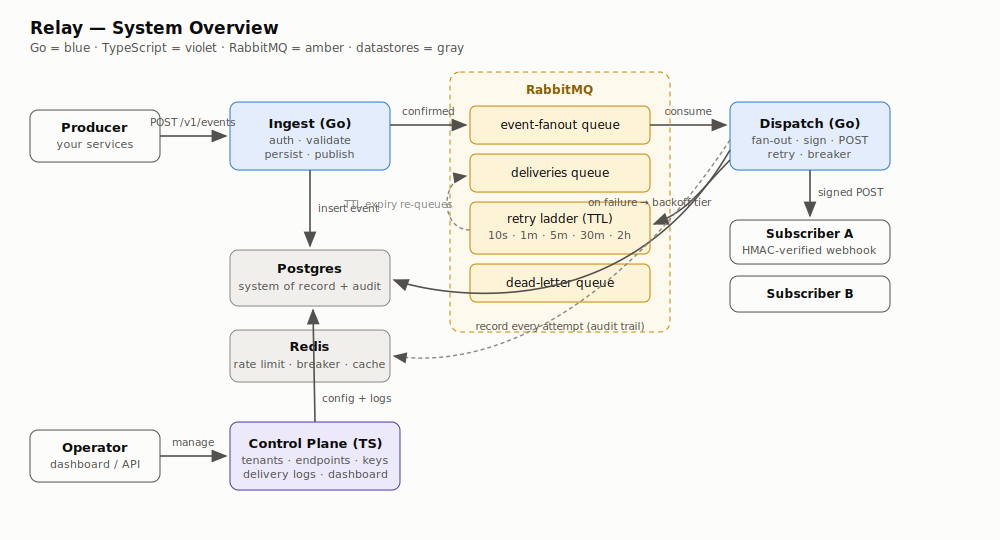
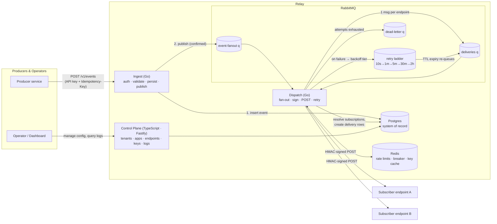
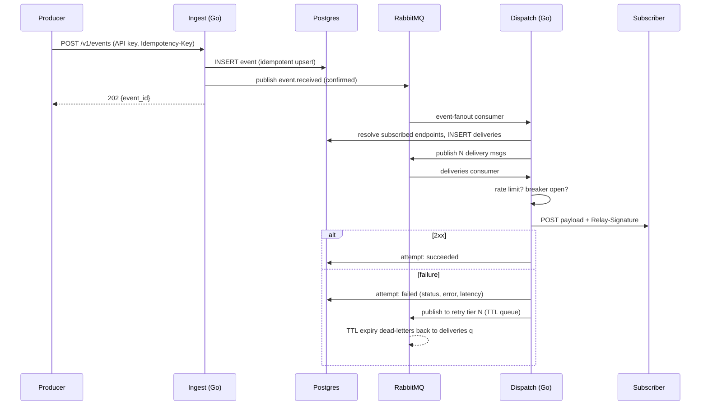

# Relay — System Overview (HLD)

Relay is a multi-tenant **webhook delivery platform**. A producer emits an event to
Relay **once**; Relay takes on the hard parts of webhook infrastructure — fan-out,
signing, retries with exponential backoff, rate limiting, circuit breaking, and a
queryable audit trail — and guarantees **at-least-once** delivery to every
subscribed endpoint.

## High-level diagram

Mermaid source (renders on GitHub)

## Components

| Component | Stack | Role |
|---|---|---|
| **Ingest** | Go, `net/http`, pgx, amqp091 | The hot path. Authenticates API keys (Redis-cached), validates the event, persists it idempotently, publishes to RabbitMQ with publisher confirms, returns `202` with the event id. |
| **Dispatch** | Go | Two consumer pools in one service. **Fan-out**: one event message → N durable `delivery` rows + N queue messages. **Delivery**: rate-limit + breaker checks, HMAC signing, HTTP POST, attempt recording, retry-ladder routing. |
| **Control plane** | TypeScript, Fastify, zod, pg | Product surface: CRUD for tenants → applications → endpoints/event types, API-key issuance (hashed at rest, shown once), delivery-log query API. |
| **RabbitMQ** | topic/direct exchanges, quorum-style durable queues | Work distribution and the retry ladder (below). |
| **Postgres** | 16 | System of record: config, events, deliveries, attempts. See [02-data-model.md](02-data-model.md). |
| **Redis** | 7 | Token-bucket rate limit per endpoint, circuit-breaker state, API-key cache. Ephemeral by design — losing it degrades performance, not correctness. |

Per-component deep dives: [ingest](03-ingest.md) · [dispatch](04-dispatch.md) ·
[control plane](05-control-plane.md) · [messaging topology](01-messaging-topology.md)

## Delivery lifecycle

## Guarantees & trade-offs

- **At-least-once, not exactly-once.** The insert-then-publish window means a crash
  between the two leaves a persisted event that was never published; the producer's
  retry (same `Idempotency-Key`) resolves it. Duplicate deliveries are possible
  (e.g. worker crash after POST, before ack) — subscribers deduplicate on
  `Relay-Id`. Exactly-once over HTTP is not achievable; we make duplicates safe
  instead of pretending they can't happen.
- **Ordering is not guaranteed** across retries by design (a failed delivery must
  not block subsequent events — no head-of-line blocking). Subscribers needing
  order use the embedded `timestamp`.
- **Isolation between tenants/endpoints**: a dead or slow endpoint affects only
  itself — rate limiting bounds throughput per endpoint, the breaker stops wasted
  work, and the retry ladder keeps failing traffic off the main queue.
- **Redis is a soft dependency**: rate limits/breaker fail open (with a log) if
  Redis is down; Postgres and RabbitMQ are hard dependencies.

## Security model

- Producer auth: per-application API keys, `sha256`-hashed at rest, prefix-indexed.
- Delivery auth: `Relay-Signature: v1=<hex HMAC-SHA256(endpoint_secret, "{id}.{ts}.{body}")>`
  plus `Relay-Timestamp` — subscribers verify both the signature and timestamp
  freshness (replay protection).
- Control plane: admin bearer token (demo-grade; SSO/JWT is a v2 concern).
