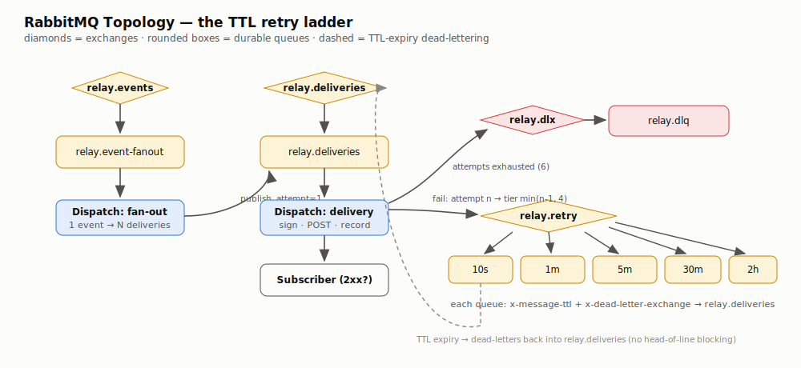
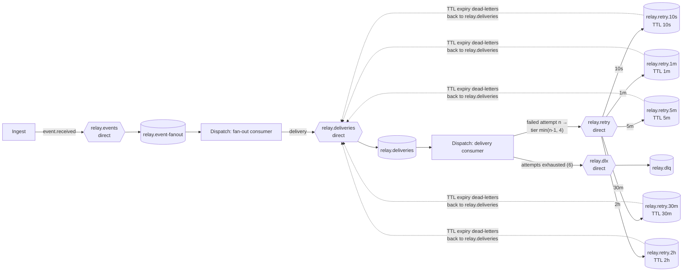

# RabbitMQ Messaging Topology — Component HLD

**Code:** [`go/internal/mq/topology.go`](../../go/internal/mq/topology.go)

Every service declares the full topology idempotently at startup, so no manual
broker setup is needed and start order doesn't matter.

## Diagram

Mermaid source

## The retry ladder (why it looks like this)

**Goal:** exponential backoff (10s → 1m → 5m → 30m → 2h) on stock RabbitMQ.

RabbitMQ has no native "redeliver in N seconds". The two standard options:

1. **Per-message TTL** in one retry queue — broken by design: RabbitMQ only
   expires the message at the *head* of a queue, so a 2h message parked in front
   of a 10s message blocks it (head-of-line blocking).
2. **Per-queue TTL ladder** (chosen) — one queue per delay tier, each declared
   with `x-message-ttl` and `x-dead-letter-exchange` pointing back at
   `relay.deliveries`. Every message in a queue has the same TTL, so expiry
   order == arrival order and nothing blocks.

A failed attempt `n` is published to tier `min(n-1, 4)`; with `MaxAttempts = 6`
a delivery's worst-case schedule is: try, +10s, +1m, +5m, +30m, +2h → DLQ.

The ladder is also reused as a **parking lot**: rate-limited deliveries park in
`10s`, breaker-open deliveries park in `1m` — in both cases *without* consuming
an attempt.

## Reliability settings

- **Durable everything** — exchanges, queues, and `DeliveryMode: Persistent`
  messages survive a broker restart.
- **Publisher confirms** — every publish waits for the broker ack; ingest returns
  `202` and consumers ack their input message only after downstream publishes are
  confirmed.
- **Manual acks + prefetch 16** — a crashed worker's unacked messages are
  redelivered (at-least-once); prefetch bounds memory and spreads work across
  worker replicas.
- **Messages carry ids, not payloads** — the payload lives in Postgres; a queue
  wipe loses schedule state, not data.
- **Poison messages** (unparseable JSON) are logged and acked, never requeued —
  a parse error can't succeed on retry, and requeueing would hot-loop the queue.
