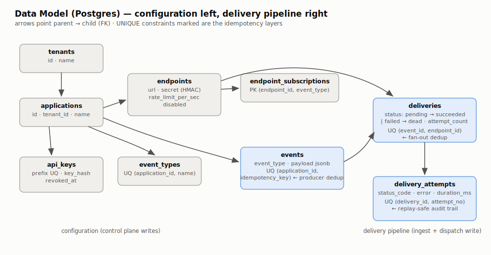

# Data Model (Postgres)

Postgres is Relay's **system of record**: tenant configuration, every accepted
event, and the full delivery audit trail. Redis and RabbitMQ can both be wiped
without losing correctness data.

## Entity diagram



<details><summary>Mermaid source</summary>

```mermaid
erDiagram
    tenants ||--o{ applications : owns
    applications ||--o{ api_keys : "authenticates producers"
    applications ||--o{ event_types : declares
    applications ||--o{ endpoints : "delivers to"
    applications ||--o{ events : receives
    endpoints ||--o{ endpoint_subscriptions : "subscribes to event types"
    events ||--o{ deliveries : "fans out to"
    endpoints ||--o{ deliveries : receives
    deliveries ||--o{ delivery_attempts : "audit trail"

    tenants { uuid id PK; text name }
    applications { uuid id PK; uuid tenant_id FK; text name }
    api_keys { uuid id PK; uuid application_id FK; text prefix UK; text key_hash; timestamptz revoked_at }
    event_types { uuid id PK; uuid application_id FK; text name }
    endpoints { uuid id PK; uuid application_id FK; text url; text secret; int rate_limit_per_sec; bool disabled }
    endpoint_subscriptions { uuid endpoint_id FK; text event_type }
    events { uuid id PK; uuid application_id FK; text event_type; jsonb payload; text idempotency_key }
    deliveries { uuid id PK; uuid event_id FK; uuid endpoint_id FK; text status; int attempt_count }
    delivery_attempts { bigint id PK; uuid delivery_id FK; int attempt_no; int status_code; bool success; int duration_ms }
```

</details>

## Hierarchy

`tenant → application → {api_keys, event_types, endpoints}`. An **application** is
the unit of isolation: API keys authenticate producers *per application*, and
endpoints subscribe to that application's event types.

## Design notes (the interview-worthy parts)

- **Idempotent ingest** — `events_idem_uq` is a partial unique index on
  `(application_id, idempotency_key)`. A producer retrying a failed request with
  the same `Idempotency-Key` gets the original event id back instead of creating
  a duplicate event.
- **Idempotent fan-out** — `deliveries_event_endpoint_uq` guarantees one delivery
  per (event, endpoint). If RabbitMQ redelivers an event message (at-least-once),
  the fan-out consumer's `ON CONFLICT DO NOTHING` insert makes the redelivery a
  no-op instead of double-delivering.
- **Idempotent attempt recording** — `unique (delivery_id, attempt_no)` means a
  worker crash after recording an attempt but before ack'ing cannot double-count
  the attempt on redelivery.
- **API keys are hashed** (`sha256`), never stored raw. The unique `prefix` column
  allows indexed lookup without knowing the key; comparison of the hash is
  constant-time in the ingest service.
- **`delivery.status` lifecycle**: `pending → succeeded | failed → dead`.
  `failed` means "will retry"; `dead` means the retry budget is exhausted and the
  message went to the DLQ.
- **`payload` is `jsonb`** — queryable for debugging, but treated as opaque bytes
  for signing (the signature covers the exact serialized body sent on the wire).

## Files

- Schema: [`deploy/postgres/init/001_schema.sql`](../../deploy/postgres/init/001_schema.sql)
- Demo seed (local only): [`deploy/postgres/init/002_seed_demo.sql`](../../deploy/postgres/init/002_seed_demo.sql)

Both are applied automatically by the Postgres container on first start
(`/docker-entrypoint-initdb.d`).
