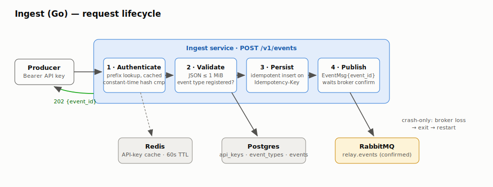
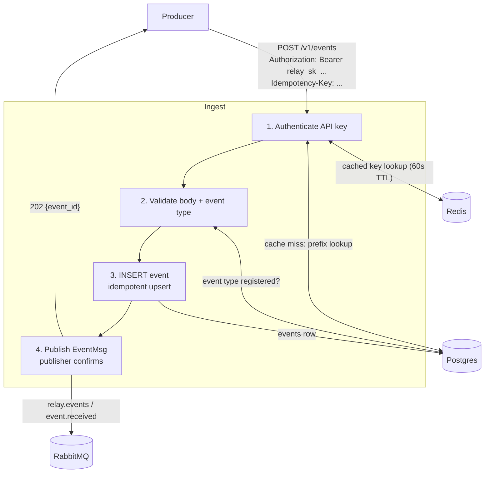

# Ingest Service (Go) — Component HLD

**Code:** [`go/cmd/ingest`](../../go/cmd/ingest/main.go) · **Port:** 8081

Ingest is the hot path: the only service producers talk to. Its job is to turn an
HTTP request into a durably persisted, queued event as fast as possible — all the
slow, failure-prone work (fan-out, HTTP delivery, retries) happens downstream.

## Diagram

Mermaid source

## Request lifecycle

1. **Authenticate** — `Authorization: Bearer relay_sk_...`. The key's 16-char
   prefix is looked up in Redis (60s read-through cache) falling back to Postgres;
   the full key's SHA-256 is compared **constant-time** against the stored hash.
   Raw keys are never stored anywhere.
2. **Validate** — JSON body (`event_type`, `payload`), 1 MiB cap, and the event
   type must be registered for the application (`422` otherwise — catches typos
   at the producer instead of silently delivering to nobody).
3. **Persist idempotently** — `INSERT ... ON CONFLICT (application_id,
   idempotency_key) DO NOTHING`. A retried request returns the original
   `event_id` with `200 {duplicate: true}` and is *not* re-published.
4. **Publish with confirms** — one small `EventMsg{event_id}` to the
   `relay.events` exchange; the handler waits for the broker's publisher confirm,
   so `202` means "the broker owns it now". Payload stays in Postgres — messages
   carry ids, the database is the system of record.

## Failure semantics (the interview answer)

| Failure | Behavior |
|---|---|
| Postgres down | `500` — nothing persisted, producer retries |
| Crash after INSERT, before publish | `500`/timeout — producer retries with the same `Idempotency-Key`, gets the stored event id back; a duplicate *event* is impossible. The unpublished event is the one at-least-once gap producers must retry through (documented in the overview). |
| RabbitMQ nacks / down | `500` — same retry story; connection loss makes the process exit and the orchestrator restarts it (crash-only recovery) |
| Redis down | Auth falls back to Postgres — slower, still correct |

## Observability

- `relay_ingest_events_total{result=accepted|duplicate|unauthorized|bad_request|unknown_type|error}`
- `/healthz` liveness, `/metrics` Prometheus, JSON structured logs (`log/slog`)
