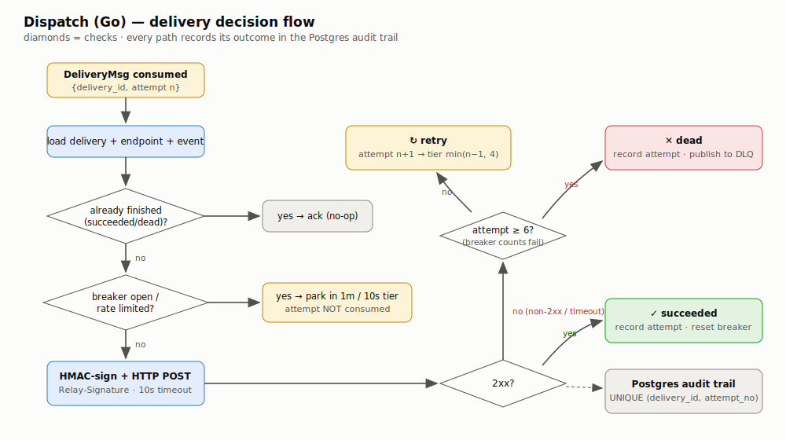
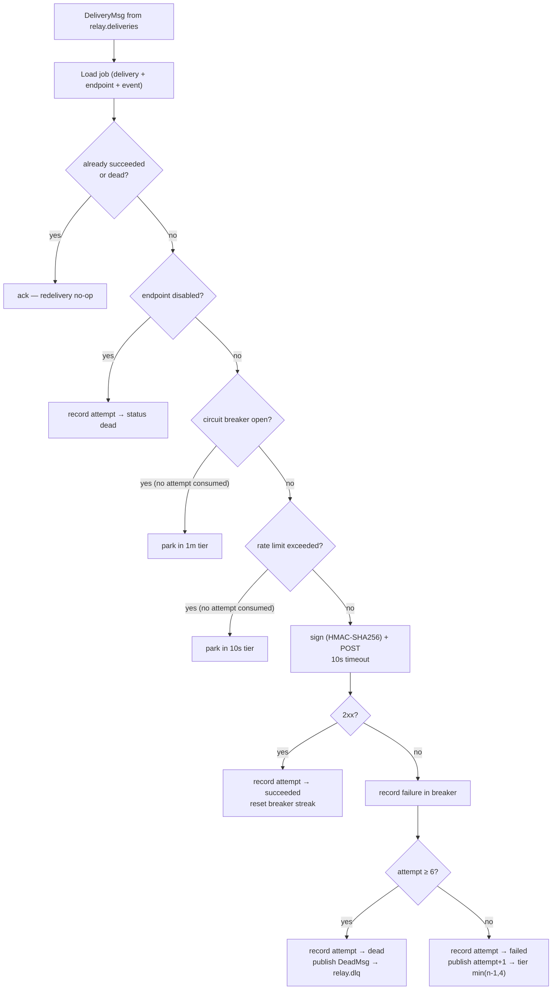

# Dispatch Service (Go) — Component HLD

**Code:** [`go/cmd/dispatch`](../../go/cmd/dispatch/main.go) · **Port:** 8082 (health/metrics only)

Dispatch is the delivery engine: it turns one accepted event into N signed HTTP
deliveries with retries, per-endpoint protection, and a full audit trail. It runs
two independent consumer loops that can be scaled horizontally just by adding
replicas (RabbitMQ round-robins consumers on the same queues).

## Delivery decision flow



<details><summary>Mermaid source</summary>



</details>

## Fan-out consumer

Consumes `relay.event-fanout`. For each event: one SQL statement inserts a
delivery row per subscribed, enabled endpoint (`INSERT ... SELECT ... ON CONFLICT
DO NOTHING RETURNING id`) and only the **newly created** ids are published as
`DeliveryMsg{attempt: 1}`. That single statement is what makes redelivered event
messages harmless — replays fan out zero new work.

## Idempotency under at-least-once

Every message can be redelivered (worker crash before ack). Three layers absorb it:

1. Finished deliveries (`succeeded`/`dead`) short-circuit to an ack.
2. The message carries its **attempt number**, and `delivery_attempts` has
   `UNIQUE (delivery_id, attempt_no)` — a replayed attempt records nothing twice.
3. Fan-out dedups on `UNIQUE (event_id, endpoint_id)`.

## Endpoint protection (isolation between tenants)

- **Circuit breaker** ([`internal/guard`](../../go/internal/guard/guard.go)):
  5 consecutive failures → breaker opens for 2 minutes (Redis key TTL = the
  half-open timer). While open, no HTTP call is made; messages park in the 1m
  tier without consuming attempts. One success after reopening resets the streak.
- **Rate limiting**: fixed 1-second window counter per endpoint in Redis
  (`INCR` + `EXPIRE`); over-limit deliveries park in the 10s tier, attempt-free.
- **Fail open**: if Redis is down, both checks allow the call and log — Redis
  degradation costs protection, never correctness.

## Signature scheme

Headers on every delivery ([`internal/sign`](../../go/internal/sign/sign.go)):

```
Relay-Id: <delivery id>            # unique per (event, endpoint) — dedup key for subscribers
Relay-Event: <event type>
Relay-Timestamp: <unix seconds>    # replay protection
Relay-Signature: v1=<hex hmac-sha256(endpoint_secret, "{id}.{ts}.{body}")>
```

The signed body is the exact wire envelope:
`{"id", "type", "timestamp", "attempt", "data"}`.

## Observability

- `relay_fanout_events_total{result}`,
  `relay_deliveries_total{outcome=succeeded|retried|dead|rate_limited|breaker_open|...}`,
  `relay_delivery_duration_seconds` histogram
- Structured JSON logs for every fan-out, dead-letter, and breaker transition.
