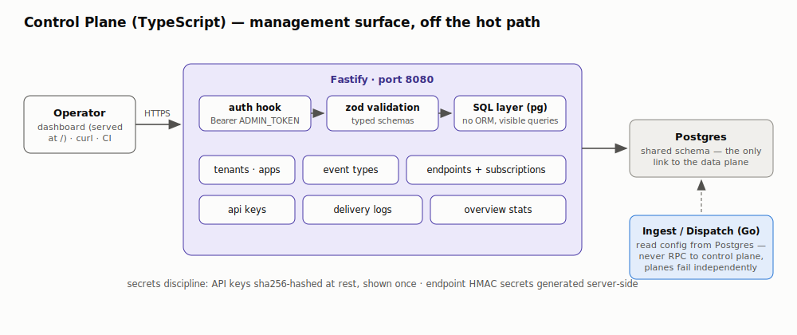
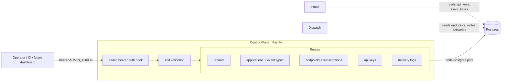

# Control Plane (TypeScript) — Component HLD

**Code:** [`control-plane/src`](../../control-plane/src/) · **Port:** 8080 ·
**Stack:** Fastify 5, zod, node-postgres, prom-client

The control plane is the **management surface** of Relay. It owns configuration
(who can send what, to whom) and the read side of the delivery audit trail. It is
deliberately OFF the delivery hot path — it shares nothing with ingest/dispatch
except the Postgres schema, so a control-plane outage never stops webhooks
from flowing.

## Diagram

Mermaid source

## API surface

| Method & path | Purpose |
|---|---|
| `POST /v1/tenants`, `GET /v1/tenants` | Tenant CRUD |
| `POST/GET /v1/applications` | Applications under a tenant |
| `POST/GET /v1/applications/:appId/event-types` | Register event types producers may send |
| `POST/GET /v1/applications/:appId/endpoints` | Create endpoint + subscriptions atomically; server generates the `whsec_` HMAC secret |
| `PATCH/DELETE /v1/endpoints/:id` | Disable, re-rate-limit, or re-subscribe an endpoint |
| `POST /v1/applications/:appId/api-keys` | Issue a producer key — raw key returned **once**, only `sha256` stored |
| `DELETE /v1/api-keys/:id` | Revoke (sets `revoked_at`; ingest's 60s cache ages out) |
| `GET /v1/events/:id/deliveries` | Fan-out status of one event |
| `GET /v1/endpoints/:id/deliveries?status=&limit=` | Delivery feed per endpoint |
| `GET /v1/deliveries/:id` | Full drill-down incl. every attempt (status code, error, latency) |

## Design notes

- **Layering**: onRequest auth hook → zod validation → route handlers → thin SQL
  layer ([`db.ts`](../../control-plane/src/db.ts)). No ORM on purpose — the
  queries *are* the interesting part (aggregated subscriptions, filtered audit
  reads) and stay visible.
- **Coordination through the database, not RPC.** The control plane never calls
  ingest or dispatch. Config changes become visible to the data plane through
  Postgres (and ingest's short-lived Redis key cache). This is what keeps the
  planes independently deployable and failure-isolated.
- **Secrets discipline**: API keys hashed at rest, shown once; endpoint HMAC
  secrets generated server-side (`whsec_` + 128-bit hex).
- **Transactions** wrap multi-row writes (endpoint + subscriptions,
  subscription replacement on PATCH).
- **Auth is demo-grade** (single `ADMIN_TOKEN` bearer) and clearly marked as the
  v2 seam where real IAM/SSO would slot into the auth hook.
- `/metrics` exposes default Node runtime metrics via prom-client; request logs
  come from Fastify's structured logger (pino).
