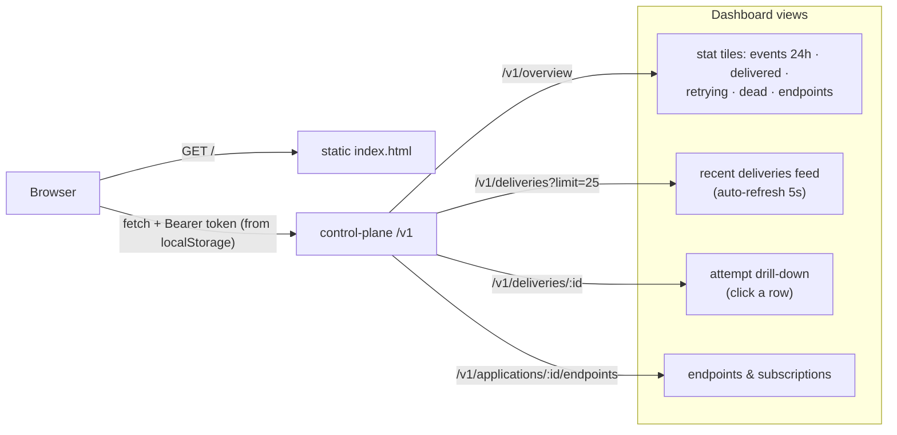

# Dashboard (Web UI) — Component HLD

**Code:** [`control-plane/public/index.html`](../../control-plane/public/index.html) ·
**URL:** http://localhost:8080 · login: the control-plane admin token

A zero-build, single-file web dashboard served by the control plane itself
(`@fastify/static`). It is a pure **read-side client** of the existing
control-plane API — it introduces no new write paths and no new service.

## Diagram

## Design decisions

- **No framework, no build step.** One HTML file with inline CSS/JS. For this
  scope (four read views) a React toolchain would be pure overhead; the trade-off
  is documented and the v2 seam is obvious (swap `public/` for a built SPA).
- **Auth model**: the page itself is public (it contains nothing sensitive);
  every data call sends `Authorization: Bearer <admin token>` which the user
  enters once (kept in `localStorage`). A 401 surfaces a hint instead of data.
- **Status is never color-alone**: badges pair a colored dot + symbol + word
  (`✓ succeeded`, `↻ retrying`, `✕ dead`), colors from a CVD-validated status
  palette; light/dark theme follows `prefers-color-scheme`.
- **Server-side aggregates**: the tiles come from one `GET /v1/overview` query
  (counts bounded to 24h) rather than the browser paging through deliveries.
- New API routes added for it: `GET /v1/overview`
  ([`overview.ts`](../../control-plane/src/routes/overview.ts)) and the global
  feed `GET /v1/deliveries` ([`deliveries.ts`](../../control-plane/src/routes/deliveries.ts)).
